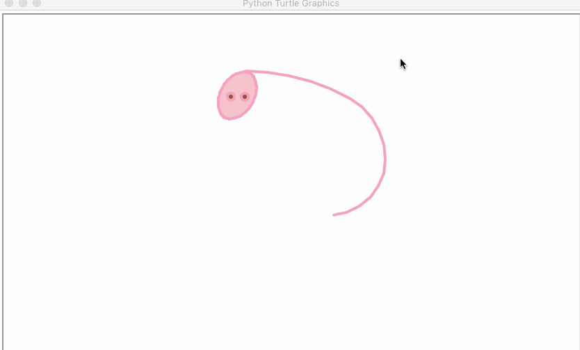

# FunnyPlayGround
This repository is made for funny projects
## Project 1: [Draw a Peppa Pig](https://github.com/WeisongZhao/FunnyPlayGround/blob/master/DrawPig%20v2.0.py):
  <div align=center><center></center>
## Project 2: [Role playing game](https://github.com/WeisongZhao/FunnyPlayGround/blob/master/RPG):

- Compile in command

```
cd RPG
javac Main.java

```
- Have fun!

```
java Main
```